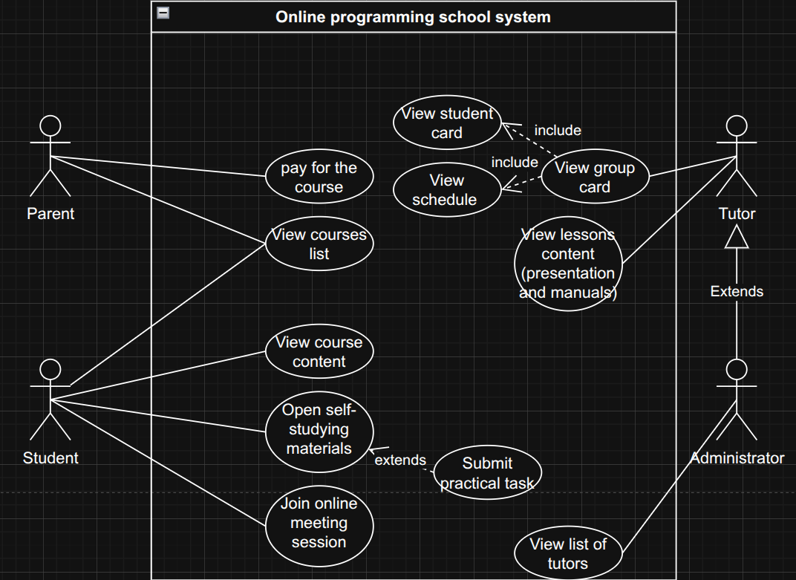

<h1>Laboratory work № 1 "Use case analysis"</h1>

**Mamchur Danylo SE-24-1**

**Purpose**: This laboratory work aims to enable students to understand and apply
use case analysis as a part of OOAD in the context of Object-Oriented Programming.

<h3>Task execution</h3>

1. **Domain:** E-Learning and Professional Skill Development (Edu / L&D)

**Problem Domain Description:**
The "Online Programming School" is a web-based platform designed to provide accessible, high-quality programming education to a global audience (mostly children). The system facilitates the entire learning lifecycle, from course discovery and enrollment to content consumption, individual learning path with a teacher (mentor), practical application, and final certification. It serves as a centralized hub for students to acquire new coding skills and for instructors to create and manage educational content.

**Scope:**

- **Included:** The core scope encompasses:

  - **User Management:** Profiles and dashboards for `Students`, `Tutors`, `Parents`, and `Administrators`.
  - **Learning Management System (LMS):** A course catalog with video lectures, text-based materials, and interactive practice tasks.
  - **Integrated Development Environment (IDE):** An in-browser tool for submitting and receiving auto-graded feedback on coding assignments.
  - **Progress Tracking:** Dashboards for students and parents to monitor performance, completed modules, and tutor feedback.
  - **Parental Portal:** A dedicated interface for parents to manage subscriptions, view progress reports, and handle billing.
  - **Safe Communication:** Moderated forums and direct messaging for student-tutor and parent-tutor communication.
  - **Certification:** A system for issuing digital certificates upon successful course completion.

- **Excluded:** To maintain a focused implementation, the following are out of scope:
  - Direct job placement or internship services.
  - Corporate/B2B training portals.
  - Advanced competitive gamification features like public leaderboards (though personal achievement badges may be included).
  - Creation of a proprietary programming language or hardware.

2. **Main notations:**
   | Notation Type | Name | Description |
   | :-------------------- | :------------------ | :------------------------------------------------------------------------------------------------------ |
   | **Actor** | `Student` `Tutor` `Parent` `Administrator` | A role played by a user or external system that interacts with the platform. E.g. Student has access to the course content and practical tasks. Tutor has access to the success rate diagrams and methodological manuals, etc. |
   | **Use Case** | `"Enroll in Course"` | An oval representing a specific system function or goal that an Actor can perform (e.g., "Submit practical task" or "Enroll to the course"). |
   | **System Boundary** | `System Boundary` | A rectangle that visually defines the scope of the system, separating internal use cases from external actors. |
   | `──────────` | **Association** | A solid line that links an Actor to a Use Case they interact with. |
   | `-include->` | **Include** | A dashed arrow from a base use case to an included one, signifying mandatory, shared functionality. |
   | `<-extend-` | **Extend** | A dashed arrow from an extending use case to a base one, signifying optional functionality. |

3. Designed **use case diagram:**
   

4. **Conclusion:** During the lab work, I gained knowledge and understanding of what use case analysis is. I identified the scope and problem domain of my system and developed a use case diagram for it. This knowledge and experience helped me gain a deeper understanding of the practical application of use case analysis. This will help me in my future growth and career as a software engineer. Although my understanding is quite good, my path is full of new opportunities for learning.

<h3>Questions</h3>

1. A **domain** is a specific field, area, or subject of inquiry, such as "healthcare" or "finance". A **problem domain** is the specific real-world context and environment surrounding a problem that needs a solution. The **scope of a problem domain** defines the boundaries of this area of analysis, determining what aspects are included or excluded to focus efforts on solving the problem effectively.

2. **Use Case Analysis** is a technique used in software engineering and systems design to identify and define a system's functional requirements from its users' perspective.

3. **Use Case Diagram** is used to graphically represent system usage flow from user's perspective, and it is created according to Use Case Analysis conclusions.

4. **Actor** - actual user/system that uses our main system. **Use Case** - specific case of usage. **System Boundary** - sequence / batch of features and functionality, that come with use cases of each feature.

5. The use case analysis process involves identifying actors and their goals, then defining use cases, creating use case diagrams to visualize relationships, and finally documenting each use case's details in a step-by-step use case description, including preconditions, the basic flow, alternative flows, and exception flows.

6. Use case analysis is closely related to the entire software development process. In the case of OOP, use case analysis helps to identify the main entities in the system (classes, subsystems) and examine them from the point of view of use. This helps to develop a more accurate and effective overall architecture.
