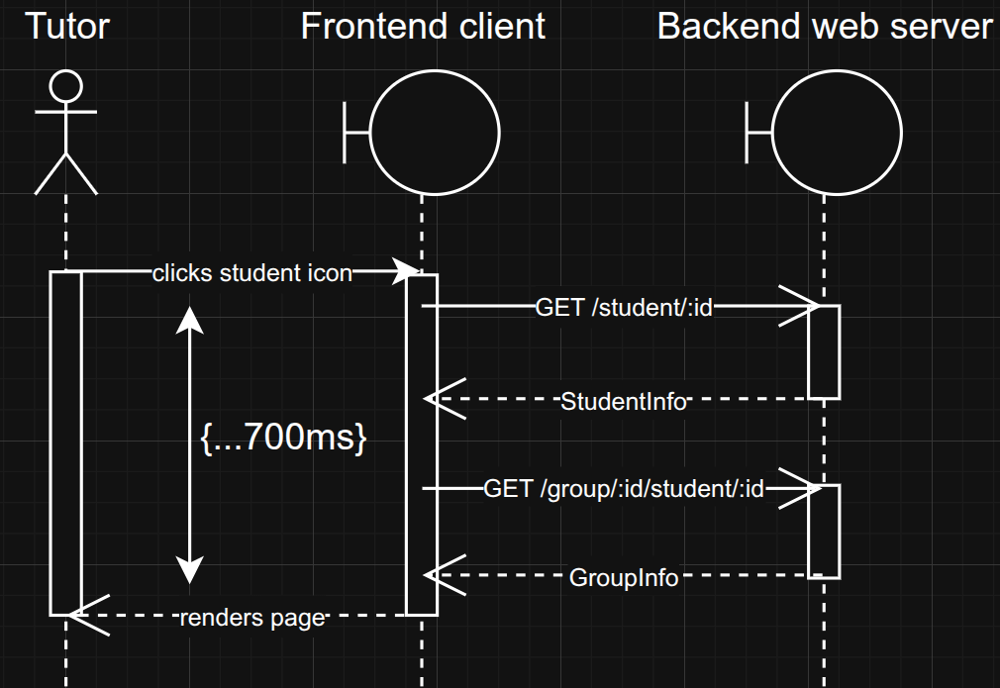
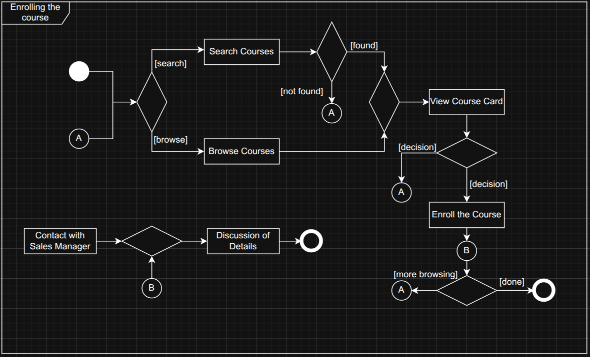
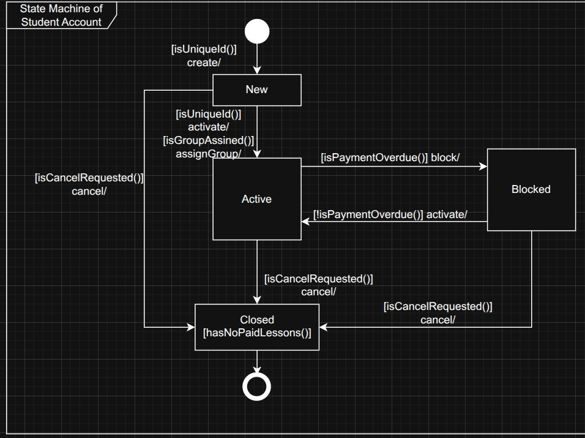
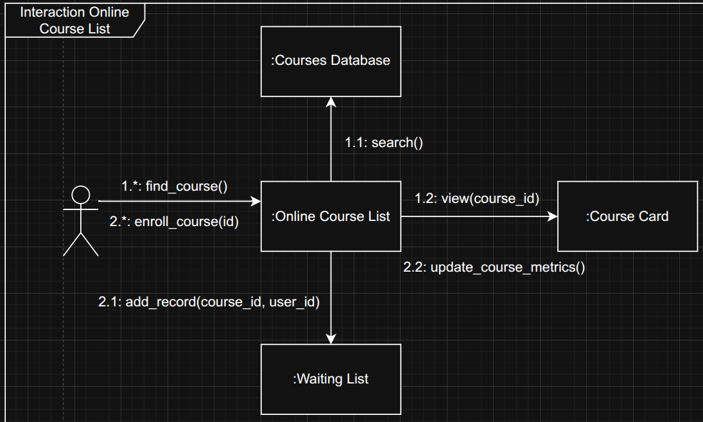

<h1>Laboratory work № 2 "Behavioral Modeling"</h1>

**Mamchur Danylo SE-24-1**

**Purpose**: A laboratory work on Behavioral Modeling in OOP aims to help students understand how objects interact over time to achieve specific system behaviors

<h3>Task execution</h3>

**Problem domain:** E-Learning and Professional Skill Development (Edu / L&D)

1. **Sequence Diagram.** Tutor tries to access student's card information, related to specific group student enrolled.
   

2. **Activity Diagram** of enrolling to the course.
   

3. **State Machine Diagram** of student's account.
   

4. **Collaboration (Communication) Diagram** of proccess of course enrollment.
   

**Conclusions:** In this laboratory work, we explored behavioral modeling in object-oriented programming by designing and analyzing activity, sequence, state machine, and collaboration diagrams. These models provided a clear view of how objects interact, change states, and coordinate actions over time. Through this, we gained a deeper understanding of system dynamics, communication patterns, and the importance of visual representations in designing complex software systems.

<h3>Questions</h3>

1. Behavioral Modeling shows how objects in a system interact and change over time to produce desired behaviors.

2. Sequence Diagrams represent the order of messages exchanged between objects.

3. Activity Diagrams describe the flow of activities or actions in a process.

4. State Diagrams show how an object changes its states in response to events.

5. Collaboration Diagrams illustrate object interactions with a focus on their relationships.

6. Other behavioral diagrams include Communication Diagrams, Interaction Overview Diagrams, and Timing Diagrams.
