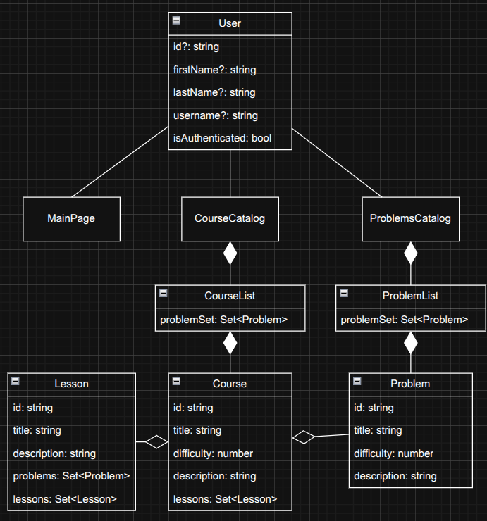
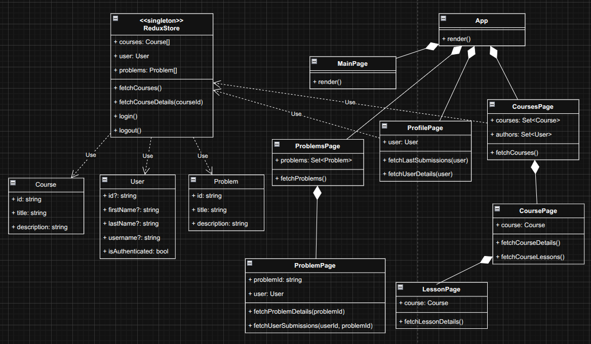

<h1>Laboratory work № 3 "Class Design"</h1>

**Mamchur Danylo SE-24-1**

**Purpose**: develop practical experience in designing and implementing classes, following core OOP principles like encapsulation, inheritance, abstraction, and polymorphism. It helps students model real-world scenarios, understand class relationships, and apply design principles to create modular, reusable, and maintainable code. Additionally, how to use abstract classes, interfaces, and UML diagrams to visualize and implement class structures effectively will be learned

<h3>Task execution</h3>

**Problem domain:** E-Learning and Professional Skill Development (Edu / L&D)

1. **CRC.** Mainly focused on Frontend subsystem, with general cover of backend subsystem.

   | Class name         | Responsibilities                                                                                |
   | ------------------ | ----------------------------------------------------------------------------------------------- |
   | LandingPage        | Marketing-focused home presenting value props, featured courses, and a sign-up/sign-in CTA      |
   | CourseCatalogPage  | Displays searchable, filterable, paginated list of available courses.                           |
   | CourseDetailsPage  | Shows course overview, syllabus/resources, instructor info, enrollment CTA, certificate status. |
   | GroupPage          | Shows group information and practical assignments for students.                                 |
   | NotFoundPage       | Renders a 404 with navigation back to catalog or landing.                                       |
   | AdminDashboardPage | Simple admin view to review, publish/unpublish, and remove courses.                             |
   | AuthCallbackPage   | Handles OAuth redirect, exchanges code for tokens, and finalizes authentication state.          |

2. **Domain Model Diagram**
   
3. **Class Diagram**
   

4. **Object diagram**
   

**Conclusions:** In this laboratory work, we explored behavioral modeling in object-oriented programming by designing and analyzing activity, sequence, state machine, and collaboration diagrams. These models provided a clear view of how objects interact, change states, and coordinate actions over time. Through this, we gained a deeper understanding of system dynamics, communication patterns, and the importance of visual representations in designing complex software systems.

<h3>Questions</h3>

1. **What is Object-Oriented programming? List its principles.**
   Object-Oriented Programming (OOP) is a programming paradigm based on the concept of "objects," which bundle data (attributes) and the code that operates on that data (methods) together. Its main principles are Encapsulation, Abstraction, Inheritance, and Polymorphism.

1. **What is Class Design in OOP?**
   Class design is the process of identifying and defining the classes, their attributes, methods, and the relationships between them that are needed to solve a problem. It essentially creates the architectural blueprint for the objects in your system.

1. **What is the class’s responsibility? What is a high cohesion and loose coupling?**
   A class’s responsibility is the specific role or set of tasks it is meant to perform within the system. High cohesion means a class's responsibilities are closely related and focused, while loose coupling means classes have minimal dependency on each other, allowing them to be changed independently.

1. **What are the Class Responsibility Collaboration cards? What is the purpose of them?**
   Class Responsibility Collaboration (CRC) cards are a simple brainstorming tool used to personify and define classes in an object-oriented design. Their purpose is to help developers explore a system's design by assigning responsibilities and identifying necessary collaborations between different classes.

1. **What is the domain model diagram? Describe the main components of the domain model diagram.**
   A domain model diagram is a visual representation of the conceptual classes or real-world objects in a specific problem domain. Its main components are domain objects (or concepts), their attributes, and the associations (relationships) between them.

1. **What does the class diagram stand for? Describe the relationships between classes.**
   A class diagram is a static UML diagram that describes the structure of a system by showing its classes, attributes, operations, and the relationships between them. Key relationships include Association (a general connection), Aggregation/Composition ("has-a" relationship), and Inheritance ("is-a" relationship).

1. **What does the object diagram stand for? Describe the relationships between objects.**
   An object diagram shows a snapshot of the instances of classes (objects) and their relationships at a specific point in time. The relationships between objects are called links, which are instances of the associations defined between their classes.
