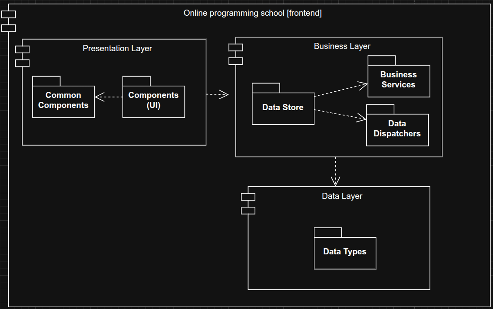
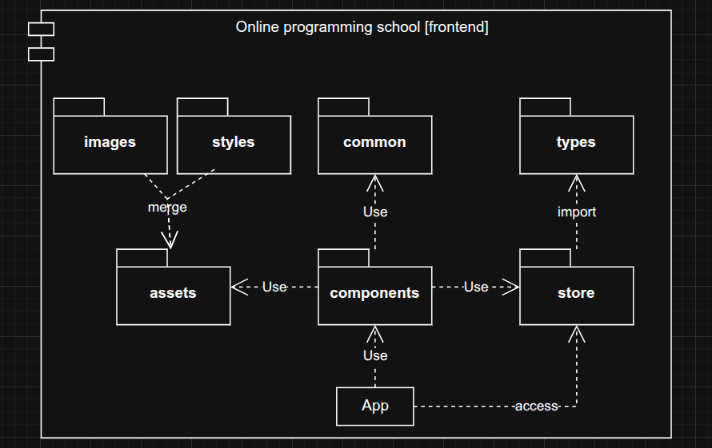
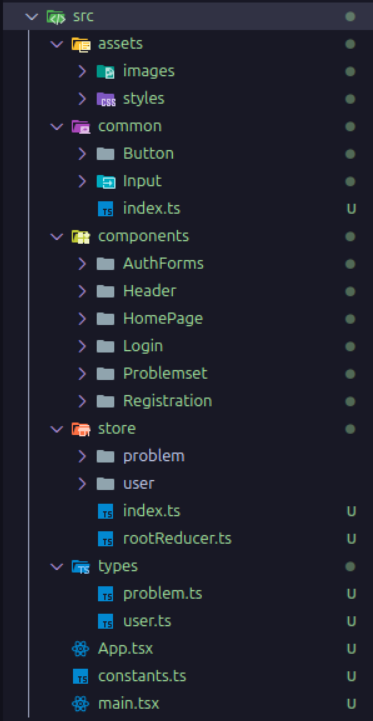
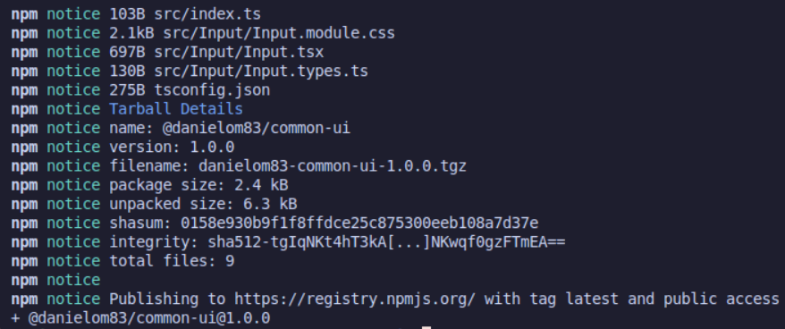

<div align="center">
<h1>Laboratory work № 5 "Classes Implementation"</h1>
</div>

**Mamchur Danylo SE-24-1**

**Purpose**: provide students with practical experience in understanding and
implementing object-oriented programming concepts, specifically focusing on classes
and interfaces; gain familiarity with defining and implementing classes and interfaces,
as well as exploring relationships such as inheritance, composition, etc. between them;
apply principles of OOP, including encapsulation, abstraction, inheritance, and
polymorphism, to build modular and scalable code.

<div align="center">
<h3>Task execution</h3>
</div>

1. In accordance with the subject area, the main components of the system were created in previous laboratory work. They are already modular and clean, so the extra step of “cleaning” and breaking down can be skipped.

2. **Model Diagram** of the current system:
   

3. **Package Diagram** of the current system:
   

4. Now, we can **organize our project** and split everything into separated libraries / packages:
   

5. We also extracted `common` modules that can be uploaded to the package manager. We will upload `common` library to the NPM package manager. Step by step:

   5.1 Create a separated common-ui package:

   ```plaintext
   common-ui/
   ├─ src/
   │   ├─ Button/
   │   ├─ Input/
   │   └─ index.ts
   ├─ package.json
   ├─ tsconfig.json
   └─ README.md
   ```

   5.2 Create and setup package.json and tsconfig.json. We can use `npm init` command for this.

   5.3 Build the package:

   ```bash
   npm install typescript --save-dev
   npx tsc
   ```

   5.4 Login and push package to the npm:

   ```bash
   npm login
   npm whoami
   npm publish
   ```

   

<div align="center">
<h3>Questions</h3>
</div>

1. **Modularity** - is the division of a program into independent, reusable parts (modules).  
   **Goal:** improve maintainability, readability, and reusability of code.

2. **Levels of modularity:**
   - **Function level:** code split into reusable functions.
   - **Class level:** functionality grouped into classes.
   - **Package/module level:** related classes grouped together.
   - **Subsystem/application level:** multiple packages combined into a complete system.

3. **Package** - a group of related modules or classes.  
   **Package manager** - a tool that automates installation, updating, and management of packages (e.g., `npm`, `pip`).

4. **Static library** - linked at compile time; becomes part of the executable (e.g., `.lib`, `.a`).  
   **Dynamic library** - linked at runtime; shared among programs (e.g., `.dll`, `.so`).

5. **OOP principles imposed by packages:**
   - **Encapsulation** (hiding implementation details),
   - **Abstraction** (clear interfaces),
   - **Modularity** (separation of concerns),
   - **Reusability** (shared components).

6. **Model diagram** - visual representation of system structure and behavior.  
   **Purpose:** to understand, design, and document the system.

7. **Package diagram** - UML diagram showing relationships between packages.  
   **Purpose:** to visualize dependencies and high-level architecture.
