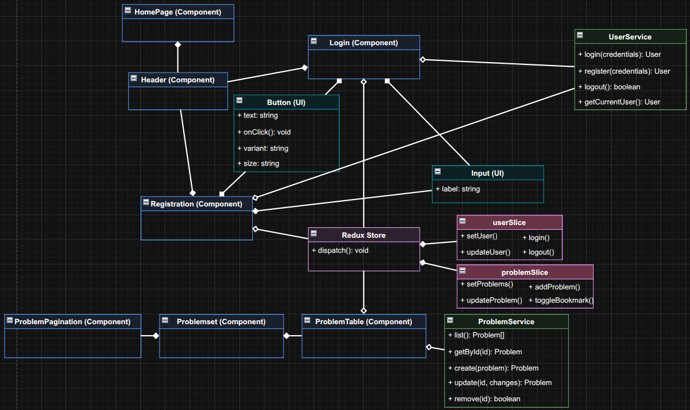
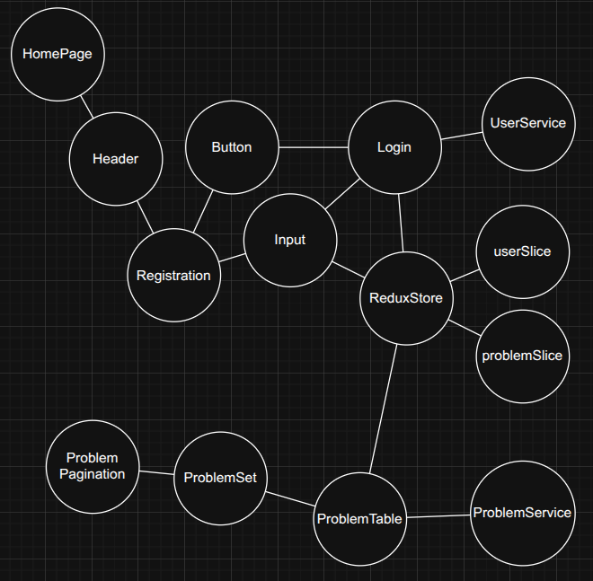
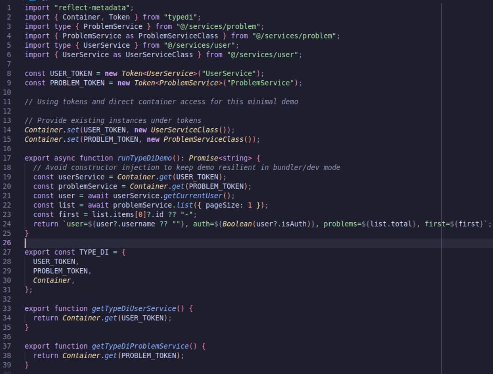
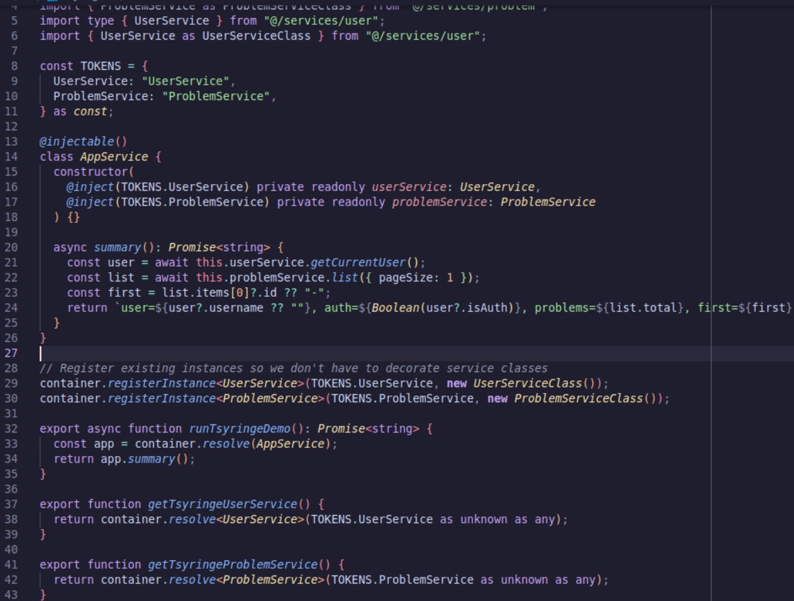
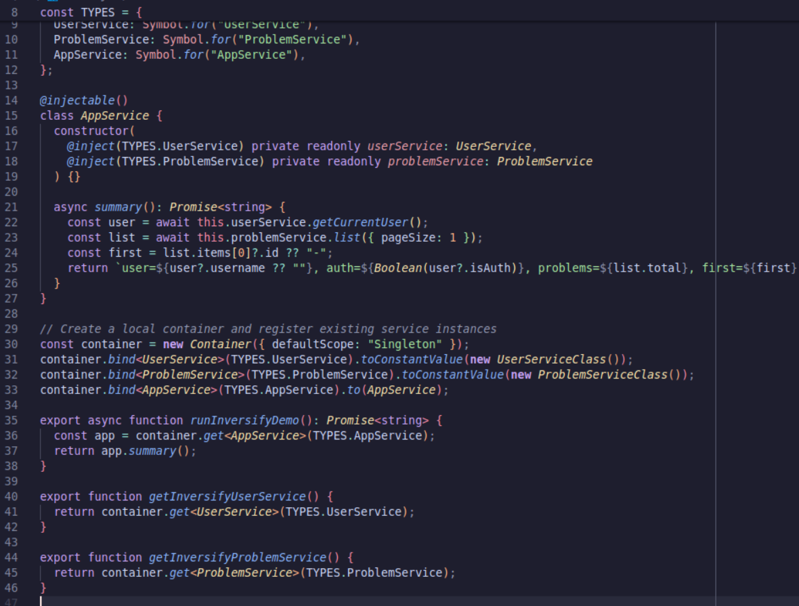
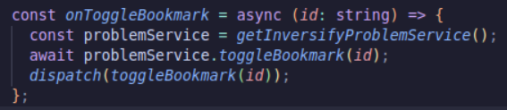
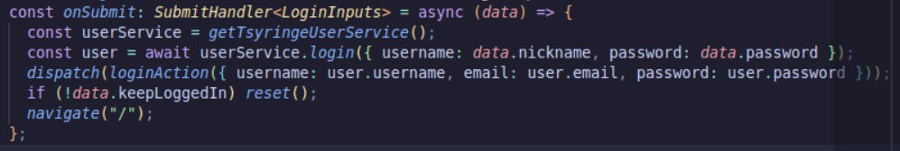
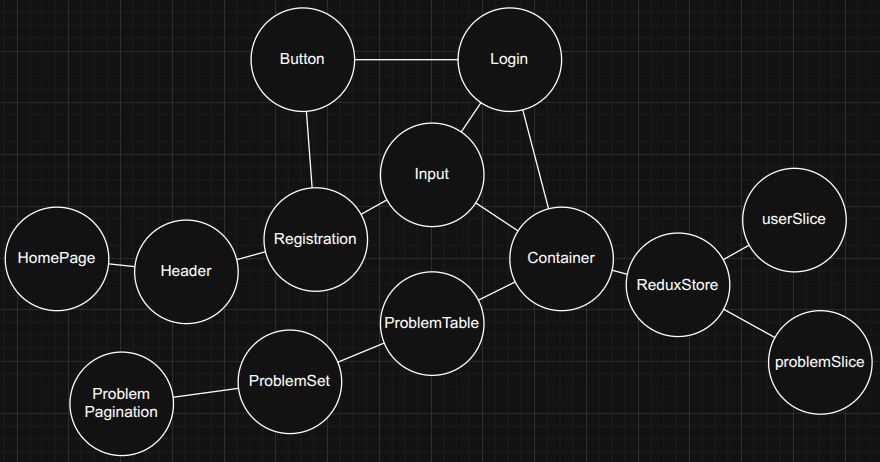
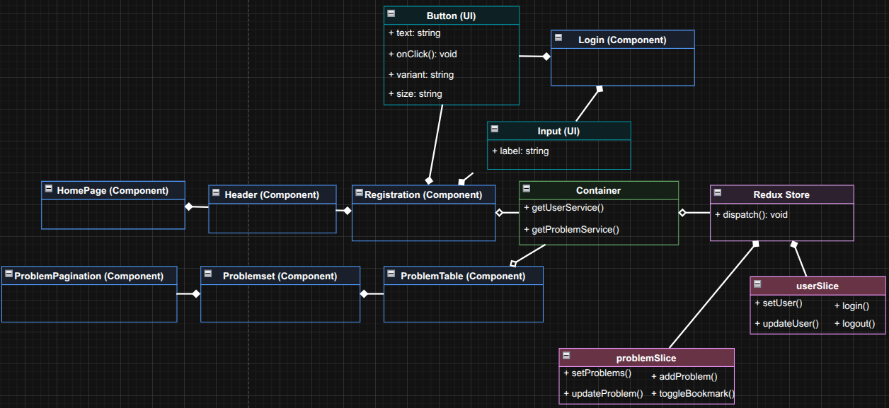

<h1>Laboratory work № 6 "DEPENDENCY MANAGEMENT"</h1>

**Mamchur Danylo SE-24-1**

**Purpose**: provide knowledge and practice of how to handle dependencies in a
way that makes code more modular, testable, and maintainable; understand how to
apply dependency injection to decouple components; gain an experience with DI
frameworks and best practices, which promote clean architecture principles.

<h3>Task execution</h3>

1. Class diagram w/ only composition and aggregation relations:
   

2. Clean dependency graph before decoupling:
   

3. The usage of three dependency management libraries:
   
   
   
   
   

4. Dependency diagram after applying the DI:
   

5. Class diagram w/ nly composition and aggragation relations (after applying the DI):
   

<h3>Questions</h3>

1. Dependency management is the practice of defining, versioning, wiring, and controlling the lifecycle of components and the external libraries they depend on to keep systems modular and reliable.
1. Loose coupling means components depend on abstractions and minimal knowledge of each other; high coupling is bad because small changes ripple widely, reducing testability and maintainability.
1. Unmanaged dependencies create hidden, hard-coded ties (e.g., new-ing services inside classes, global singletons), causing brittle code, version conflicts, and order-of-initialization bugs.
1. Instruments include DI frameworks/containers (InversifyJS, TSyringe, TypeDI), package managers (npm/yarn), build systems (Vite/Webpack), and module systems with semantic versioning.
1. Dependency injection is supplying a component’s dependencies from the outside rather than creating them internally; types include constructor, setter/property, and method/parameter injection.
1. An IoC container is a runtime registry/factory that constructs objects, resolves their dependencies, and manages scopes/lifecycles to invert control from consumers to the framework.
1. A dependency graph is a directed graph of components and their dependency edges; a dependency tree is a rooted, acyclic view (often from a package manager) showing transitive dependencies per root.
