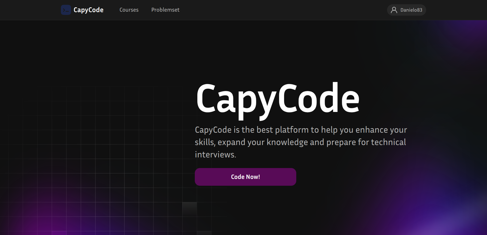

<div align="center">
<h1>Laboratory work № 8 "GRAPHICAL USER INTERFACE DEVELOPMENT. APPLICATION DEPLOYMENT"</h1>
</div>

**Mamchur Danylo SE-24-1**

**Purpose**: provide hands-on experience in designing, implementing, and refining
user-friendly interfaces for software applications, and learn best practices for creating
visually appealing and functional GUIs that enhance user interaction. Additionally, the
lab focuses on deploying applications, ensuring that students understand the steps and
tools required to distribute and maintain software effectively in real-world
environments.

<div align="center">
<h3>Task execution</h3>
</div>

1. Example of an UI component (Main Page): the code and the screenshot.

   ```typescript
   const HomePage: React.FC = () => {
      return (
         <>
            <Header />
            <section className={styles.hero} aria-labelledby="homeTitle">
            <div className={styles.container}>
               <h1 id="homeTitle" className={styles.title}>
                  CapyCode
               </h1>
               <p className={styles.subtitle}>
                  CapyCode is the best platform to help you enhance your skills, expand your knowledge and
                  prepare for technical interviews.
               </p>
               <Link to="/problemset">
                  <Button text="Code Now!" className={styles.button} />
               </Link>
            </div>
            </section>
         </>
      );
   };
   ```

   

2. All the UI issues fixed. Asynchronous programming used to provide better UX. For example, Login component has form handling logic:

   ```typescript
   const onSubmit: SubmitHandler<LoginInputs> = async (data) => {
      const userService = getTsyringeUserService();
      const user = await userService.login({ username: data.nickname, password: data.password });
      dispatch(loginAction({ username: user.username, email: user.email, password: user.password }));
      if (!data.keepLoggedIn) reset();
      navigate("/");
   };
   ```

3. The implementation of two-way binding comes with ReactHookForms library. The core idea: any tweaks / changes in UI (inputs, forms) updates the state. And any changes in state (like submitting the form) updates UI:
   ```typescript
   <form onSubmit={handleSubmit(onSubmit)} className={styles.form} noValidate>
      <div className={styles.logo_container} aria-label="CapyCode">
      
      CapyCode
      </div>

      <Input
      className={styles.input}
      type="text"
      placeholder="Nickname"
      autoComplete="username"
      {...register("nickname")}
      />
      <Input
      className={styles.input}
      type="password"
      placeholder="Password"
      autoComplete="current-password"
      {...register("password")}
      />

      <div className={styles.checkbox_container}>
      <Input
         className={styles.checkbox}
         type="checkbox"
         label="Keep me logged in"
         {...register("keepLoggedIn")}
      />
      </div>

      <Button type="submit" text="Sign in" className={styles.submit} />

      <div className={styles.bottom_container}>
      <p>
         <span>Don’t have an account?</span>
         <Link to="/register">Sign Up</Link>
      </p>
      <Link to="/forgot-password">Forgot password?</Link>
      </div>
   </form>
   ```

4. In the previous laboratory work I've implemented multithreading part for the profile image updates and used Web Workers for that. However, I do not implement unsubscription from the Worker's messages, even if the user leaves profile page. Let's fix that by adding an appropriate useEffect callback:

   ```typescript
   // Cleanup object URLs when component unmounts
   useEffect(() => {
      if (!ResizeWorker) return;

      const handleWorkerMessage = (ev: MessageEvent) => {
         const { blob, error } = ev.data || {};
         if (error) {
         console.error("Resize worker error:", error);
         return;
         }
         if (!blob) return;
         const url = URL.createObjectURL(blob);
         setAvatar(url);
      };

      ResizeWorker.addEventListener("message", handleWorkerMessage);

      // Cleanup = unsubscribe
      return () => {
         ResizeWorker.removeEventListener("message", handleWorkerMessage);
      };
   }, []);
   ```

<div align="center">
<h3>Questions</h3>
</div>

1. **What is the GUI?**  
GUI (Graphical User Interface) is the visual part of an application that allows users to interact with it through graphical elements like buttons, forms, and menus, rather than text commands.

2. **What is the layout map?**  
A layout map defines how UI elements are positioned and arranged on the screen. It helps ensure consistency and proper alignment across different screen sizes or components.

3. **Why do GUI freezes happen? How to prevent them?**  
GUI freezes occur when the main thread is blocked by heavy computations or synchronous operations. To prevent freezes, offload long tasks to background threads, use asynchronous programming, or employ Web Workers in web apps.

4. **What is two-way binding? Its purpose.**  
Two-way binding is a mechanism where changes in the UI automatically update the data model, and changes in the model update the UI. Its purpose is to keep the UI and data in sync effortlessly.

5. **When do we need to unsubscribe from events?**  
We need to unsubscribe when components unmount or when event listeners are no longer needed. This prevents memory leaks and avoids unintended behavior from stale callbacks.

6. **What is event bubbling?**  
Event bubbling is the process where an event propagates from the target element up through its ancestors in the DOM. It allows parent elements to handle events triggered by child elements.

7. **What is application deployment? What is an installer and its purposes?**  
Application deployment is the process of releasing and setting up an application on a target environment for users. An installer is a program that automates the installation process, sets up files, dependencies, and configurations for easy and correct deployment.
